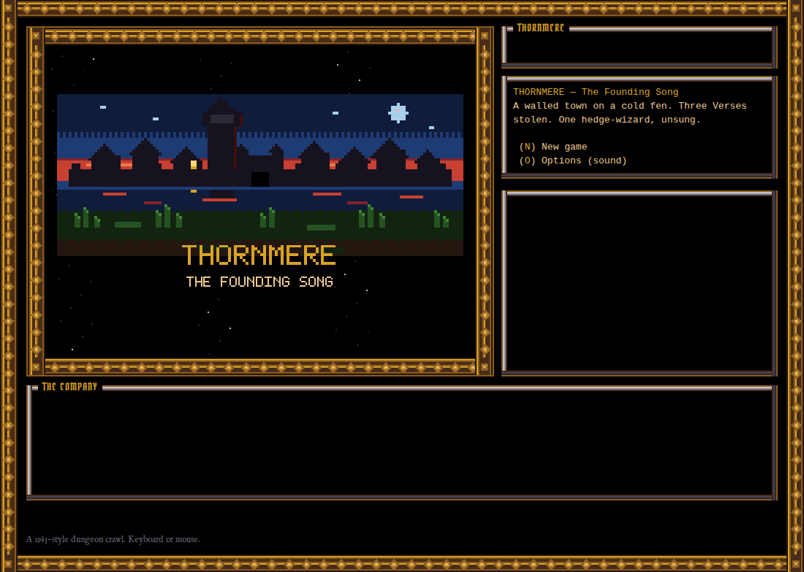
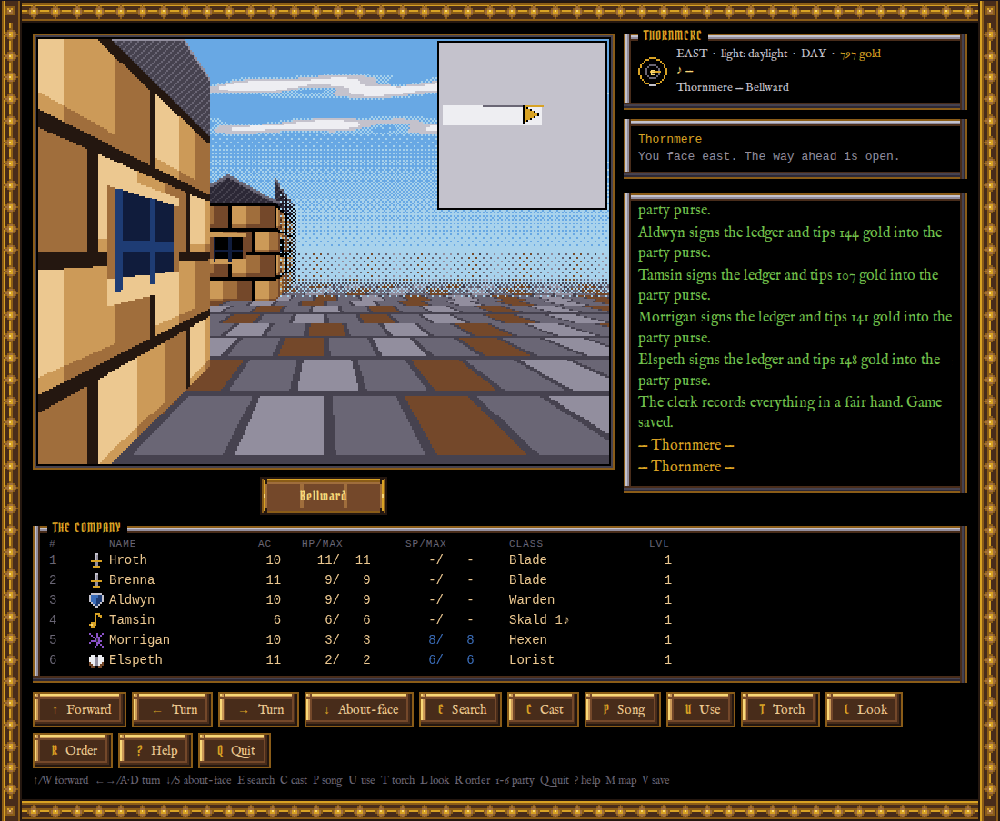
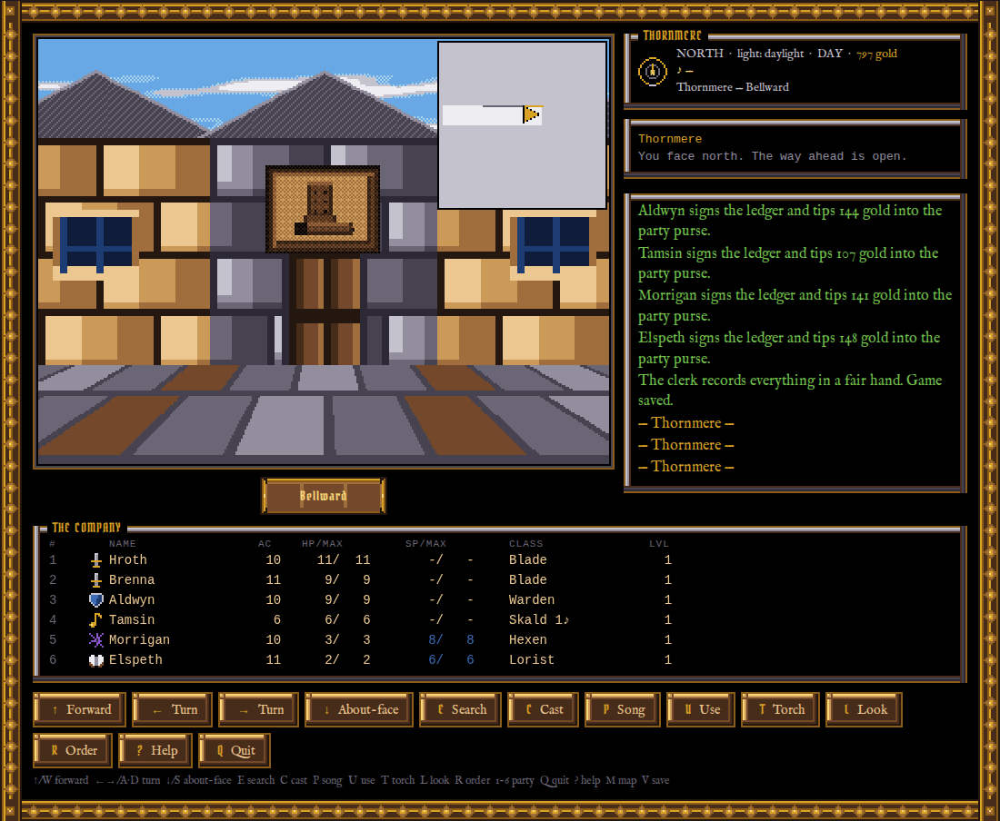
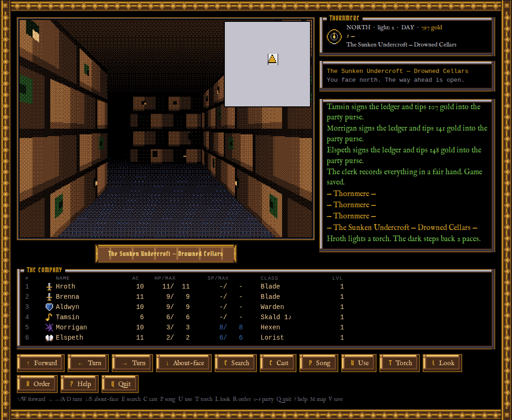
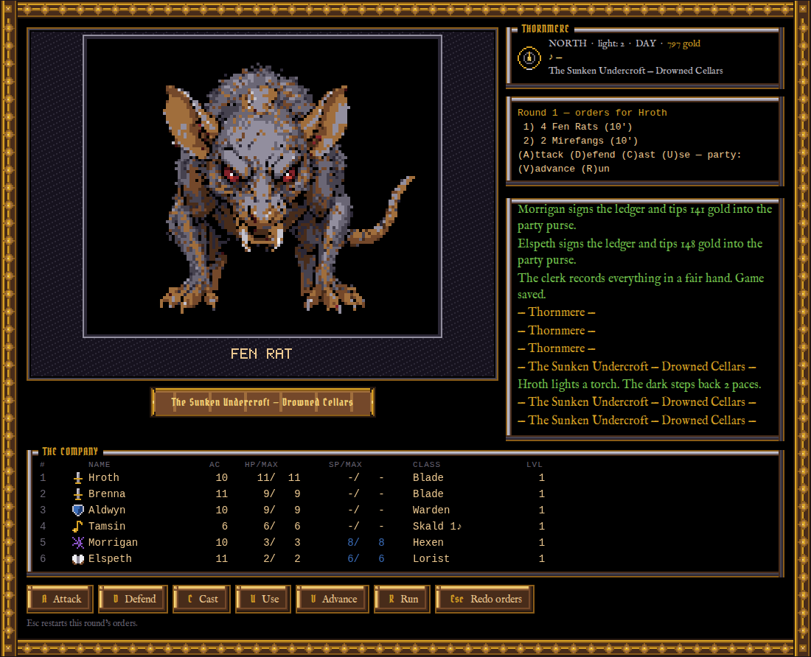
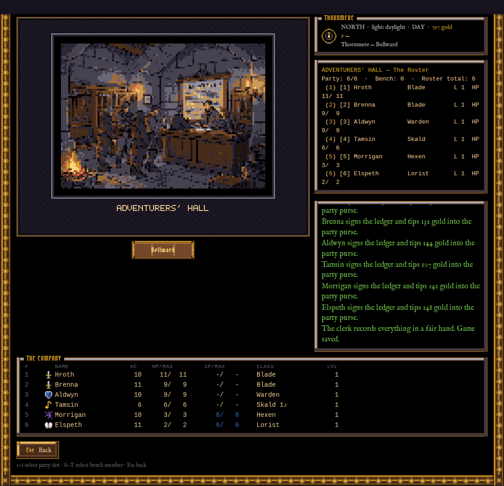
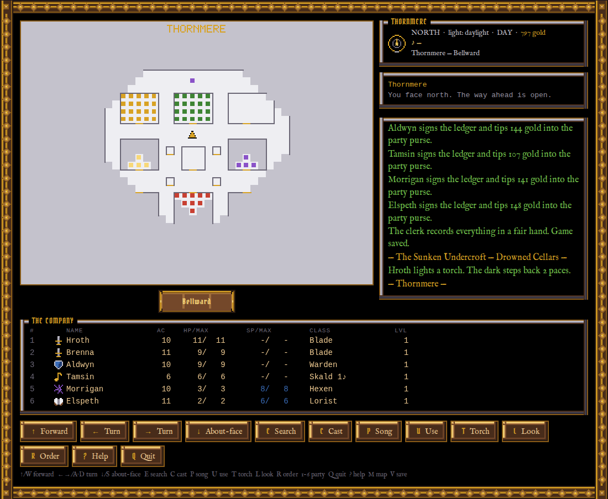
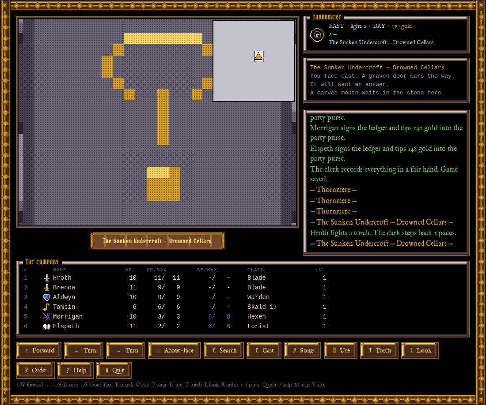

# THORNMERE — The Founding Song

A complete, playable, classic first-person dungeon crawler in the style of the
1985 originals — solid, colorful bitmap graphics in the manner of the Amiga
era: a textured maze viewport with palette distance-shading, an **animated
monster portrait window**, signboards you navigate by, a synthesized chiptune
soundtrack, and full mouse support beside the keyboard. All content — the town
of Thornmere, the three dungeons, 50+ monsters, 84 spells, 7 songs, 60+ items,
every sprite and every melody — is original, and lives in editable text data
files.

> The hedge-wizard **Maldrec the Unsung** has stolen the Three Verses of the
> Founding Song that ward Thornmere's gates against the fen-wights. Recover
> them — from the Sunken Undercroft, the Howling Barrow, and Maldrec's Needle —
> and sing the gates whole.

**[▶ Play it in your browser](https://dgahagan.github.io/THORNMERE/)** — no
install, no build, no accounts. Saves live in your browser's localStorage.



| | |
|---|---|
|  *Thornmere by day — the street hazes into the sky* |  *Navigation by signboard, like 1985* |
|  *The Sunken Undercroft by torchlight* |  *Orders, please — the portrait window animates* |
|  *Muster the company at the Adventurers' Hall* |  *The Remastered parchment automap* |
|  *Some doors want an answer* | |

## About this project

Thornmere is a demo project built to test **Claude Fable 5** when the model
was new: 98 commits over a month (June–July 2026), with the game's code, pixel
art, chiptune score, maps, balance passes, tests and documentation produced in
Claude Code sessions — including printable "feelies" and the retrospective in
[`LESSONS.md`](LESSONS.md). The build's paper trail lives in the repo as
deliberate provenance: the art-generation record (`data/art/gen-manifest.json`),
the sprite adjudication log (`art-review/`), and the session handoff docs.

The portrait art has its own story: monster portraits, boss showpieces and
interiors were generated by a **local FLUX.2-klein model on a desk-side GPU**,
quantized down to the 32-color palette as text grids, and adjudicated sprite
by sprite against procedural generators — seeds, prompts and verdicts all on
record. **[How the art was made →](docs/art-pipeline.md)**

## Stack justification

Vanilla JavaScript (ES modules) + HTML5 Canvas, **zero dependencies, no build
step, no binary assets**. The game renders to a 320×240 indexed-color
framebuffer (a `Uint8Array` of palette indices) scaled 2× with
nearest-neighbor — chunky square pixels, exactly like the hardware it imitates.
The DOM handles the text panels and mouse buttons; `localStorage` provides the
save system and audio settings; WebAudio synthesizes every note and sound
effect from pattern data at runtime. Because the game core (`src/core/`) is
pure logic with no DOM access, the same modules run under `node --test` for
the automated test suite. Install friction is one command: any static file
server runs it, and the only requirements are a browser and Node (for
tests/tools).

## Install & run

Play the hosted build at **https://dgahagan.github.io/THORNMERE/**, or run it
locally:

```sh
npm start          # = python3 -m http.server 8377  (or: npx serve)
# then open http://127.0.0.1:8377/
npm test           # logic + art + audio data integrity suites
```

No accounts, no network access, no downloads — everything is in this repo.
**All audio is synthesized in code; all art (including the ornate UI chrome) is
text-grid pixel data — every sprite and melody is original to this repo.** The
only bundled binaries are four OFL-licensed period fonts under `assets/fonts/`,
each committed beside its license (Pirata One, IM Fell English, MedievalSharp).

Beyond the gallery above: the dungeon guardians and Maldrec get large
showpiece portraits in combat, and the roster carries a portrait chip and
class icon beside every name with condition colors — wounded yellow, critical
red, poisoned green, stoned grey, dead dark-red.

## Presentation polish (global — both modes)

A period-interface pass over the original engine, applied to Remastered and
Legacy alike (no new toggles):

- **Ornate chrome & period type.** An ornate thorn-vine frame (hand-pixeled
  9-slice `border-image` from `data/art/chrome.json`) surrounds the game; panels
  carry carved bevels with blackletter nameplate tabs, the viewport sits over a
  carved location plaque, and buttons are carved wood with gold keycaps. Headers
  are blackletter (**Pirata One**); narration is an old-style serif (**IM Fell
  English**); columnar text (menus, roster) stays monospace for alignment. Fonts
  are OFL, bundled with their licenses under `assets/fonts/`.
- **Bright-light view distance.** Outdoors at noon the party sees ~6 tiles down
  the street, the farthest planes dithering into a sky-coloured haze. Dungeon
  torchlight and the magical-darkness zones keep their short, claustrophobic
  radius — underground vision is byte-for-byte unchanged.
- **Smooth step.** Forward/backward moves apply instantly (events, traps, the
  automap), then the camera glides one cell (~140ms, eased) instead of warping.
  Turning stays instant; bumps, teleporters and combat snap the camera to the
  true cell.

## Keys

| Exploring | |
|---|---|
| `↑` / `W` | step forward |
| `←` `→` / `A` `D` | turn left / right |
| `↓` / `S` | about-face |
| `E` | search the walls for secret doors |
| `C` | cast a spell |
| `P` | play / stop a bard song |
| `U` | use an item (potions, scrolls, chalk…) |
| `T` | light a torch (quick) |
| `L` | look (re-read the cell, re-use stairs) |
| `1–6` | character sheet: equip, trade, drop |
| `O` | options: master/music/effects volume, mute (persisted) |
| `Q` | quit to menu (autosaves — labelled modern mercy) |
| `?` | help |
| `Esc` | back out of any menu |

**Mouse:** everything answers to the mouse as well — the command bar shows
every available action as a button (with its hotkey), menu lines and roster
rows click, arrows over the viewport move and turn the party, the wheel
scrolls the event log, and clicking the viewport hurries combat narration. A
full playthrough is possible without touching the keyboard, and equally
without touching the mouse.

| In combat (orders per character) | |
|---|---|
| `A` attack (pick a group) | `D` defend (AC bonus) |
| `C` cast (pick spell + target) | `S` sing (Skald, one round) |
| `H` hide in shadows (Knave) | `U` use an item |
| `V` party advances 10' | `R` the party runs |
| `Space` | hurry the narration |

| `M` | cycle automap (off → corner overlay → full-screen) — Remastered only |
| `V` | make camp / save to a slot — Remastered save-anywhere only |
| `7` | view summon sheet — Remastered 7th-slot only |

**Debug:** add `?debug=1` to the URL, then `M` toggles an automap overlay
(always available in debug, even in Legacy mode).
`?seed=N` gives a reproducible run.

## Beginner's primer

1. **Walk forward into the Adventurers' Hall** and (C)reate six characters.
   A proven first party: **Blade, Blade, Warden, Skald, Hexen, Lorist** —
   front three take the hits, Skald sings, two casters behind.
   Korrun make brutal Blades; Aldari make the best casters; reroll until your
   front-liners have ST/CN 15+.
2. **(S)ave**, leave, and shop at **Greta's Provisioner** (east of the Hall):
   broadswords and leather for the front rank, a shortsword and *reed pipe*
   for the Skald, daggers and robes for the casters, **and torches** — the
   Undercroft is dark.
3. Your casters already know their first tier from the muster — Ash Dart for
   the Hexen; Mending Word and Scholar's Glow for the Lorist, so you can light
   the dark for free from the first step. The **Review Board** (Magistrate's
   Court) sells the higher tiers as you level.
4. **Farm XP safely** by entering the shuttered houses along the east and west
   rows (bump into a door face-on). Each visit risks a low-level encounter (day
   25%, night 40%) and may turn up loose coin. Heal at the Temple between runs.
5. Listen to rumors at **The Drowned Goose** (2g). They point at the boarded
   tannery on the north row.
6. **The Boarded Tannery → descend.** Light a torch (`T`). Fight a few packs,
   grab a chest or two, and run home before HP and SP run dry. There is no SP
   regeneration underground.
7. Back in town: heal at the **Temple of the Quiet Flame**, recharge SP at
   **Roskva's Spark House**, level up at the **Review Board** (leveling only
   happens there — never in the field), wine for the Skald at a tavern,
   **save at the Hall**.
8. Repeat. The riddle-door's answer is something a chandler would say. The
   Tallow King below is a level-5–6 fight; bring Eyebright or nothing false.

The long game: Verses One and Two open the **bell tower**; the Needle is
anti-magic-riddled and teleporter-mad; its top floor will not open without a
**Riddlemaster** (Hexen/Lorist → tier 5 → change class to Stormcaller → tier 6
in two schools → Riddlemaster, at the Review Board; class change resets level
but keeps every spell). Perform the Founding Song at the bell tower with all
three Verses to win.

## Remastered vs Legacy

At the start of every new game you choose an **experience**:

| Mode | What's on |
|------|-----------|
| **Remastered** | All modern comforts: automap, save anywhere, shared inventory, reduced XP, item charges, 7th summon slot |
| **Legacy** | Bit-for-bit identical to the classic rules. Bring graph paper. |
| **Custom** | Toggle any feature individually at game-start |

Choosing **Custom** shows a checklist. Locked features (Shared Inventory, Reduced XP) cannot be changed after game-start because they alter character progression; the rest can be toggled via the in-game Options screen (`O`).

### The seven comforts

| Feature | Description |
|---------|-------------|
| **Automap** | `M` cycles off → corner overlay → full-screen parchment map. Only visited cells are drawn. Spinners desync the map (cursor drifts from your actual position); the Compass spell re-syncs. A gold marker shows your believed position; candle-colored = desynced. |
| **Save anywhere** | `V` in the dungeon opens a slot menu (3 manual + 1 autosave). Autosave also triggers on dungeon level transitions and on quit. The Adventurers' Hall save still works in all modes. |
| **Shared inventory** | Instead of 8 individual packs, the party shares a 40-slot pool. Loot drops straight into it; buy directly to it at Greta's. In the character sheet, press `Pn` to *claim* an item from the pool (it moves to the character's pack and auto-equips); press `R` to return a carried item to the pool. Class restrictions still apply. **Locked at creation.** |
| **Reduced XP** | XP requirements are **×0.60** of the 1985 curve (40% lower). The exact multiplier lives in `data/balance.json` → `remasteredXpMultiplier`. **Locked at creation.** |
| **Item charges** | Items with `maxCharges` (currently Eyebright Tonic ×2, Phase Chalk ×3) track remaining uses; the inventory shows `(N ch)`. Without this feature on, each use consumes the item regardless. |
| **Summons: 7th slot** | Summoned creatures take a dedicated slot *above* the 6-person roster instead of occupying a party slot. Key `7` opens the summon's stat card. Only 1 summon at a time; casting a new summon dismisses the old one. |

### In-game reference (always on, all modes)

These are baseline QoL that don't require any toggle:

- **`?` help** — key reference + active Remastered features listed
- **Review Board → Browse known spells** — read-only spell reference for any character (`B` at the Review Board)
- **Character sheet → Inspect item** (`I`) — shows damage/AC stats and flavor text for any carried item
- **Tavern → Rumor journal** (`J`) — review every rumor your party has heard

### Balance note

The reduced XP multiplier (0.60) was tuned for a party that clears dungeon levels thoroughly before descending. A rush strategy on Legacy XP risks being under-levelled for the Needle; on Reduced XP, thorough play produces slightly over-levelled parties. Adjust `data/balance.json` to taste.

## The shape of the game

- **Stats** ST/IQ/DX/CN/LK (3–18 + race): melee damage, spell points, AC &
  missile aim, hit points, saving throws. **AC counts down from 10.**
- **Combat**: up to 4 monster groups at 10'–90'; melee reaches 10', missiles
  and spells have ranges; groups advance every round. Orders are collected for
  the whole party, then resolved in DX-influenced initiative, narrated
  line-by-line. Poison, level drain, stoning, SP drain and fear are real —
  the Temple cures all of it, for gold.
- **Magic**: three schools (Hexen, Lorist, Stormcaller), 7 tiers × 4 spells
  each. Casters know tier 1 from creation (as in 1985); higher tiers are
  bought whole at the Review Board. Anti-magic zones fizzle
  casting and strip your active effects. Summons (and illusions — true
  seeing kills illusions, both yours and theirs) occupy a party slot.
- **Songs**: 7 Skald songs, each with an exploration effect (persistent) and
  a one-round combat effect. Songs-per-day = Skald level; tavern wine
  restores them. No instrument, no song.
- **The maze**: secret doors, spinners, teleporters, darkness zones,
  anti-magic zones, magic mouths, trap squares, riddle-locked doors (type the
  answer), stairs — all data-driven per cell. Dungeons are dark: torches and
  light spells set your view radius, and the palette ramps darker with every
  step of depth. Secret doors are drawn as ordinary wall until found. Each
  dungeon hides at least one secret room with a unique item.

## The ten-minute playtest tour

A scripted walk that shows off everything. Start a **Remastered** game
(`?seed=7` for the canonical tour) unless noted.

1. **Mode selection** — New game → choose **Remastered**. Observe the mode
   screen's three options; try **Custom** once to see the toggle checklist,
   then go back and start Remastered.
2. **The street** *(art: facades + signboards)* — Turn right at the start and
   walk east along the row: Greta's boot-sign, then the scales of the
   Magistrate's Court. Navigation-by-signboard, like 1985. Note the day sky
   dithering toward the horizon and the street hazing with distance. Hover
   the viewport: movement arrows appear — **do this leg mouse-only**.
3. **Muster at the Hall** *(portraits)* — walk forward into the Hall, create
   a party (Blade, Blade, Warden, Skald, Hexen, Lorist) — each newcomer picks
   a **face** at creation; watch the portrait window while you choose. SAVE.
4. **Shop to pool** *(shared inventory)* — into Greta's: buy a couple of
   items and confirm they appear in the **party pool** (not individual packs).
   Open any character sheet and press `P1` to claim an item and equip it.
   The gold jingle plays per purchase.
5. **Item inspect** *(in-game reference)* — in the character sheet, press `I`
   and inspect an item: stats and flavor text appear in the log.
6. **Review Board — spell browse** — step into the Magistrate's Court, pick a
   caster, press `B` (Browse known spells): the read-only spell list appears
   with SP costs and explore/combat tags.
7. **Rumor journal** *(in-game reference)* — visit a tavern, buy two rounds
   (`R`), then press `J` (Journal): your heard rumors reprint. A third round
   adds a new entry.
8. **Songs back to back** *(audio centerpiece)* — outside, press `P` and
   start the **Wayfarer's March**; walk a few steps, then switch to the
   **Graveman's Dirge**. Two unmistakably different tunes, switched without pop.
9. **The Undercroft + automap** — north row, the Boarded Tannery, descend.
   Light a torch (`T`). Walk around. Press `M` once: **corner overlay**
   appears, visited cells marked. Press `M` again: **full-screen parchment
   map** fills the viewport. Press `M` a third time: map off. Navigate a few
   more steps and confirm the cursor tracks correctly.
10. **Save-anywhere** — deep in the dungeon press `V`: the camp menu shows 3
    named slots. Save to slot 1 and confirm. Return to the main menu, load
    slot 1, and verify you wake at the same spot.
11. **A fight** *(animated portrait + combat)* — wander until BATTLE: the
    combat theme kicks in. If you summoned a creature beforehand (Remastered
    7th-slot), press `7` outside combat to see its stat card.
12. **Legacy check** *(regression gate)* — start a second game and choose
    **Legacy**. Confirm: no `M` automap (only `?debug=1` version), no `V`
    save key, inventory is per-character (8 slots, trade menu). XP requirements
    are visibly higher at the Review Board. All 53 automated tests pass.
13. **Options** — press `O`: audio controls use new keys (A–F for
    volume, X mute, Z done). In Remastered mode the feature toggles are also
    visible (locked ones are dimmed). Reload to confirm audio settings persist.

## Editing content (no code required)

Everything the engine reads lives in `data/`:

```
data/races.json      data/classes.json    data/items.json
data/spells.json     data/songs.json      data/monsters.json
data/maps/*.json     ← generated, committed
data/art/*.json      ← every sprite, texture and animation (text grids)
data/audio/*.json    ← every melody and sound effect (note patterns)
```

### The art pipeline (hand-edit any sprite)

All art is **text-grid pixel maps**. A sprite is rows of characters; a legend
maps each character to one of the **32 master palette colors**
(`data/art/palette.json`); `-1` is transparent:

```json
"fx_chest": {
  "w": 16, "h": 12,
  "legend": { ".": -1, "w": 9, "O": 11, "i": 3, "L": 29 },
  "rows": [
    "..wwwwwwwwwwww..",
    ".wOOOiOOOOiOOOw.",
    "..."
  ]
}
```

Open the file, change the characters, reload the page — that's the whole
pipeline. Rules: every row must be exactly `w` characters, there must be `h`
rows, and every character must appear in the legend (`node tools/artcheck.js`
checks all of it; `npm test` includes the same checks plus coverage — every
monster, building, special and character archetype must resolve to art).

- **Animations** are frame lists with per-frame duration:
  `"anims": { "fx_mouth_anim": { "frames": [{ "sprite": "fx_mouth", "ms": 320 }, …] } }`.
  Idle loops run at 2–4 fps, period-correct.
- **Variants** map a game id to a base sprite plus a palette remap — the 1985
  palette-swap trick: `"moor_hound": { "base": "mon_hound", "remap": { "10": 3 } }`
  turns the leather-brown hound slate-dark. Every monster in the bestiary
  resolves through one.
- The **sprite preview page** (`/dev.html` while the server runs) renders the
  complete art set — palette, every sprite, live animations, every variant
  with its remap applied — and flags anything broken or any monster without
  art. Bad art is visible at a glance and fixable per-sprite.
- Wall textures are 16×16 tiles per area (`data/art/textures.json`), chosen in
  `data/art/styles.json` along with floor/ceiling/sky treatments. Secret doors
  render the plain wall tile until found — by design.

### The audio pipeline (hand-edit any melody)

`data/audio/music.json` holds every piece of music as note patterns: a token
is `note:sixteenths` (`c4:2`, `f#3:1`) or `r:n` for a rest, played by a
`square`, `pulse`, `tri` or `noise` voice with a simple envelope — a
SID/Paula-flavored synth (`src/audio/synth.js`). Each of the **7 bard songs**
has its own recognizable looping melody (played while the song is active in
exploration — learn to tell the Confounding Jig from the Graveman's Dirge by
ear) plus a one-round combat flourish; the Skald's instrument quality detunes
the timbre slightly. There's a town theme with a sparser night variant, a
distinct drone per dungeon (sinking lower with each depth), a combat theme,
a victory fanfare, a death sting and a title theme. `data/audio/sfx.json`
holds every sound effect as a synth recipe. Music ducks under effects;
volumes and mute live in the in-game options (`O`) and persist.

Maps are emitted by `npm run genmaps` (`tools/genmaps.js`): layouts come from
seeded maze generation; stairs, bosses, riddles, mouths, zones, secret rooms
and encounter tables are hand-authored specs in that file. The generator
asserts full connectivity and that each riddle door actually gates its stairs.

Dev tools: `node tools/balance.js` (win-rate simulation across the campaign),
`node tools/drive.js <combat|shop|riddle|boss|review|victory>` (Playwright UI
scenarios, uses the globally-installed @playwright/mcp's browser),
`test/smoke.html` (in-page scripted run under headless Chrome),
`node tools/artcheck.js` (sprite validation), `/dev.html` (sprite preview).

## Feelies

Three printable documents are included, modeled on the paper inserts that shipped with boxed games in 1985:

```sh
npm run build-feelies
# Output: feelies/thornmere-map.pdf
#         feelies/thornmere-manual.pdf
#         feelies/thornmere-command-card.pdf
```

PDFs are generated deterministically from game data — no binary assets, no hand-typed numbers. The PDFs themselves are `.gitignore`d; the generator scripts and source data are version-controlled.

| File | Contents | Format |
|------|----------|--------|
| `thornmere-map.pdf` | "Cloth map" of Thornmere: street grid, named buildings, gates, guardian statues, Maldrec's Needle, legend, compass rose | Landscape A4 |
| `thornmere-manual.pdf` | ~25-page manual: races (with stat modifiers), classes (prime stats), places, exploration, combat, magic, spell tables (all 84 spells from data), song list, items (Greta's stock), tips, reference | Portrait A4 |
| `thornmere-command-card.pdf` | All keybindings, new-game flow, roster abbreviations, Remastered vs Legacy toggle table | Landscape A4, fold in half |

**Printing tips:**
- The map looks best printed in color and folded to A5 or smaller — crease lines add authenticity.
- The command card can be folded in half or taped to the monitor.
- The manual can be stapled on the left spine or ring-bound.

All numeric data in the PDFs (spell SP costs, race stat modifiers, item prices) is read from `data/` at build time. A test in `test/feelies.test.js` verifies that mutating a spell's SP cost in the DB is reflected in the manual's collected text.

## Tests

`npm test` covers four suites:

- **Logic** (original 27 tests + 11 Remastered tests, 53 total): combat resolution and
  boss phases, leveling math and the class-change chain to Riddlemaster,
  save/load round-tripping the entire game state mid-delve, map traversal
  (walls both sides, spinners, teleporters, riddle gating, perimeter
  integrity), data integrity (84 spells, every referenced monster/item exists,
  the three Verses are placed), v1→v2 save migration, XP multiplier monotonicity,
  item charge depletion, 7th-slot slot accounting, spinner desync preconditions.
- **Art** (`test/art.test.js`): every sprite's text grid matches its legend
  and dimensions; every monster in the bestiary resolves to a portrait; the
  three dungeon guardians and Maldrec have 48×48+ showpieces; every town
  building has a signboard and interior; every special has furniture art;
  magic mouths animate; every race × archetype × face has a character
  portrait; every class has an icon; every area has wall/door textures.
- **Audio** (`test/audio.test.js`): every pattern parses, tracks within a
  pattern agree on length (loops can't drift), all 7 bard songs have distinct
  loops plus flourishes and match `data/songs.json`, all themes exist, and the
  full SFX set is well-formed.
- **Feelies** (`test/feelies.test.js`): map legend entries validate against town
  cell data; streets array is well-formed; spoiler lint (no forbidden strings in
  generated text); SP cost propagation (mutate DB, verify collectManualText reflects
  it); class primeStat fields are present and valid for all starting classes.
